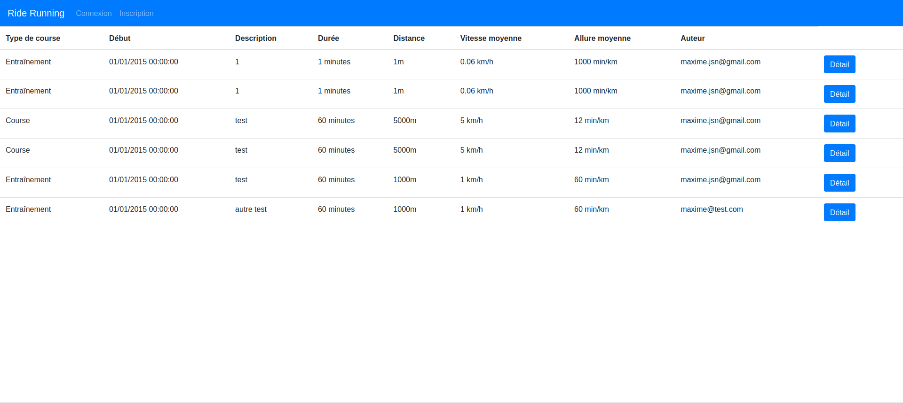
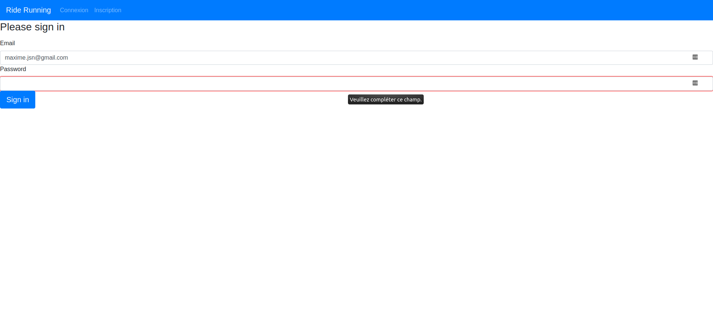
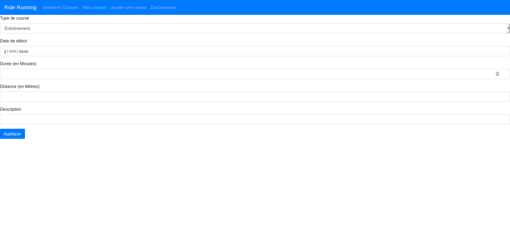
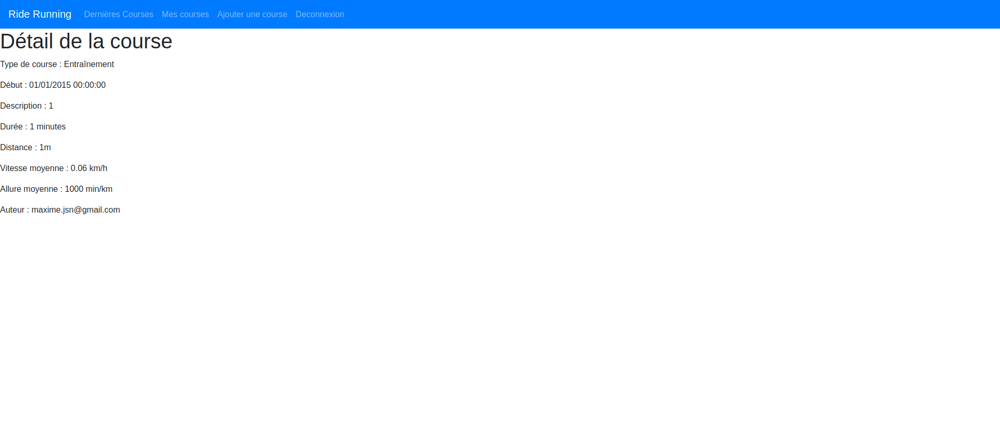

#Projet de gestion de courses à pieds

## Durée du développement : 5h30

## Features
- Inscription
- Connexion
- Déconnexion
- Création d'une course à pied
- Listing des courses (via API)
- Listing des courses d'un utilisateur (via API)
- Détail d'une course (via API)
- Possibilité de modifier une course à pied
- Liste des types de courses en base de données #possibilité de rendre administrable les types plus tard

## Exécution du projet
`docker-compose up -d --build`

Site utilisable sur URL : http://localhost

## Images du site
### Accueil

### Connexion

### Ajout d'une course

### Détail

